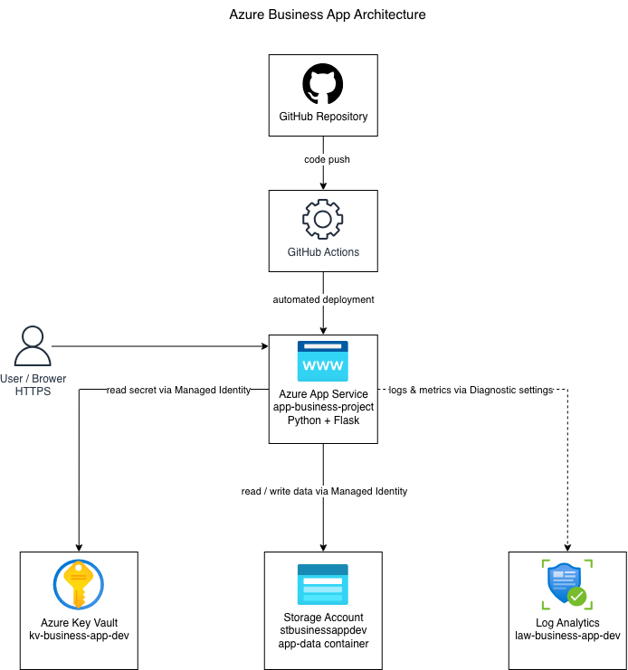

# Azure Business App

A small Azure project built to practise cloud hosting, secure configuration, storage, monitoring and CI/CD deployment.

## Overview

This project is a simple internal business application built with Python and Flask and deployed to Microsoft Azure.

The application is hosted on Azure App Service and uses Managed Identity to access Azure Key Vault and Azure Blob Storage without storing credentials directly in the code.

GitHub Actions is used to automatically deploy changes from the main branch to Azure App Service.

## Architecture



## Azure Services Used

- Azure App Service
- Azure Key Vault
- Azure Blob Storage
- Azure Managed Identity
- Azure Monitor / Log Analytics

## Other Technologies

- Python
- Flask
- Git
- GitHub
- GitHub Actions

## Features

- Python Flask application hosted on Azure App Service
- Automatic deployment using GitHub Actions
- Secure access to Azure Key Vault using Managed Identity
- Read and write data using Azure Blob Storage
- Application logs and metrics sent to Log Analytics
- Simple internal business note interface

## Security

The application uses Azure Managed Identity so credentials do not need to be stored directly in the source code.

Azure Key Vault is used for secure configuration, while access to Blob Storage and Key Vault is controlled using Azure RBAC roles.

## Monitoring

App Service diagnostic settings send console logs, HTTP logs and metrics to a Log Analytics Workspace for monitoring and troubleshooting.

## Project Notes

Microsoft Entra ID authentication was explored, but app registration permissions were restricted by the university tenant used for this project.

The current application is a public demonstration environment and does not include user authentication.

## Architecture Decisions

Azure App Service was selected because it provides a simple managed platform for hosting the Flask application without managing a virtual machine.

Managed Identity was used to avoid storing Azure credentials in the application.

Azure Blob Storage was used for simple application data storage, and Log Analytics was added to provide basic monitoring and troubleshooting.

## Repository Structure

```text
azure-business-app-project/
├── app.py
├── requirements.txt
├── templates/
├── static/
├── docs/
│   └── azure-architecture.png
└── README.md